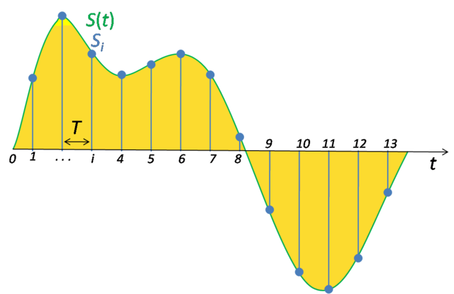

Sound, as we know, is formed by a set of mechanical waves that travel through the air (and other transmission mediums). As they reach our ears, we end by perceiving these waves as vibration that are interpreted by our brain.

But, you might be asking: since this information is transmitted continuously, how can we represent it as digital information? What happens is that we can sample continuous information at predefined time intervals, encoding each sample numerically. So, if we provide a sufficient number of samples per unit of time, we are able to store this information properly without losing information that can be perceived by our brains.

So, to understand more deeply the ideias introduced earlier, some basic concepts related digital audio are explained hereafter.

## Sample rate
It is used to designate the frequency in which sound is sampled per unit of time. An image is shown below to illustrate the concept. 

_Image from [wikipedia](https://en.wikipedia.org/wiki/Sampling_(signal_processing))_

What is shown in the image is that the analog signal **S(t)** is sampled periodically at a **T** time interval, matching an amplitude value to every discrete time i. In this case, we end up by having 14 values **(0..13)** that represent the analog signal digitally with a sample rate of **1/T**
 _(see how frequency relates to period **T** [here](https://en.wikipedia.org/wiki/Frequency#Definitions))_. 

The used sample rate can vary depending on the how the sound will be used. Music audio usually have a sample rate of 44.100Hz, while audios from movies, for example, can have a rate of 192.000Hz. These rates are directly related on how realistic the audio will be perceived, as well as how wholesome it will be stored as discrete information. These peculiarities are briefly described by the _[sampling theorem](#sampling-theorem)_.

## Sampling theorem
According to the Nyquist-Shannon Sampling Theorem, to properly reconstruct an analog signal after its sampling, it should be done using a minimum sampling frequency **F*s***, that needs to be _greater or equal_ to **2F*h***, where **F*h*** is the highest frequency component of the signal being sampled. The equation is shown below:

$$ F_{sampling} \geq 2F_{highest} $$

**F*h***  is also called the _Nyquist frequency_ and the inverse of the minimum sampling frequency **1/F*s*** is known as the _Nyquist rate_.

## Sample format
All these information captured through time needs to be represented as binary values, therefore using different amount of bits to represent a these values. This amount is also called bit depth. The difference of using a small or a big amount of bits reflects on how precise the wave amplitudes of signal will be represented digitally, since these values are rounded to a representable binary number when captured. 

The difference of the variations of bit depth can be clearly perceived by listening to an old 8-bit audio from [Super Mario Bros.](https://en.wikipedia.org/wiki/Super_Mario_Bros), followed by an 24-bit uncompressed audio from a [Pink Floyd](https://en.wikipedia.org/wiki/Pink_Floyd)’s song. The number of values that can be represented by different amounts of bits plays a big role on how realistic the sound will be perceived. More information about that is given in the next subsection.

## Pulse code modulation

**PCM** is the method used for representation of a analog signal digitally. It is majorly applied in audio signals. The method consists on sampling the amplitude of the analog signal at fixed intervals, then each sample is modulated according to the sample format, being quantized to the nearest value that can be represented. An example can be seen below:

_Image from [wikipedia](https://en.wikipedia.org/wiki/Pulse-code_modulation)_

In the given example, there are _16 levels_ of representation, so it could be represented as a _4 bit binary number_. Each blue dot represent the moment that the signal was sampled. The result of that sampling should be a sequence of numbers with a specific sample rate that represents the audio digitally, without any compression.

### References

- Newmarch, J. (2017). Linux Sound Programming. [Apress](https://www.apress.com/us/book/9781484224953).
- Digital Audio. [Wikipedia](https://en.wikipedia.org/wiki/Digital_audio).
- Hearing. [Wikipedia](https://en.wikipedia.org/wiki/Hearing).
- Nyquist-Shannon sampling theorem. [Wikipedia](https://en.wikipedia.org/wiki/Nyquist%E2%80%93Shannon_sampling_theorem).
- Pulse Code Modulation. [Wikipedia](http://en.wikipedia.org/wiki/Pulse-code_modulation).
 

_That's it!_

